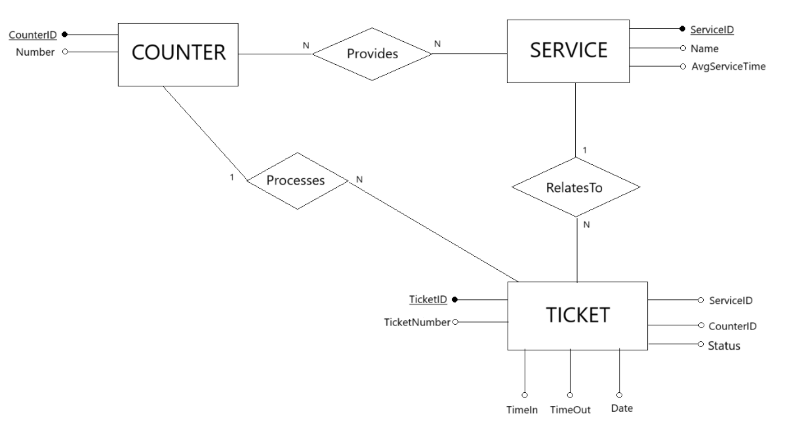

### Frontend
# Main React Components

# Routes
- POST /ticket
- GET /service/list
- GET /:id/next_ticket

### Backend
# Dao
- DB interaction 
- Queues for each service maintained in specific, dynamic data structures (I assume in Dao but I trust you guys)

# API
- new_ticket(service_name: String): takes the service name, produces a unique ID for the tiket and puts the ID in the appropriate queue, then sends back the ticket ID to the customer
- get_services(): just returns all the available services

### Routes description
- /ticket
    - Method: POST
    - Request body: { Service name: String,
                        ServiceID: number }
    - Response body: { TicketID: String }
    - Response: 201 (created), 404 (service not found), 500 (generic error)

- /service/list
    - Method: GET
    - Request body: none
    - Response body: [
                        {
                        ServiceID: number,
                        Service name: String 
                        },
                        ...
                        ]
    - Response: 200 (ok), 500 (generic error)

- /:id/next_ticket
      - Method: GET
      - Request body: none
      - Reponse body: { ticketID: string }
      - Response: 200 (ok), 500 (generic error)    

### DB Description
COUNTER-SERVICES (==CounterID==, ==ServiceID==)

COUNTERS (==CounterID==, Number)

SERVICES (==ServiceID==, AvgServiceTime, Name)

TICKETS (==TicketID==, ServiceID, CounterID, StartTime, EndTime, Status)

PROCESSED-REQUESTS (==TicketID==, ServiceID, CounterID, Date) //this table is tecnically for the statistics story, but since we are doing de DB we might as well create it, up for debate if we really want to do it or not

